# RFC Translater

RFCを翻訳するツール群 & 翻訳済みRFCサイト

### 目的
1. RFCの英語を読むのが辛いので、Google翻訳した文を横に並べたものを読みたい。
[RFCの日本語訳リンク集](https://www.nic.ad.jp/ja/tech/rfc-jp-links.html)では原文と日本語訳が別々のページで、日本語訳が正しいのか判断しにくい問題がある。
2. RFCの本文は改行済みのため、改行を削除してからGoogle翻訳に貼り付けないと正しく翻訳されない。改行を削除する煩わしさを解決する。

### 流れ
1. **src/fetch_index.py**: RFC一覧の取得。取得先： https://tools.ietf.org/rfc/index
2. **src/fetch_rfc.py**: 個別RFCの取得。取得先： https://datatracker.ietf.org/doc/html/rfcXXXX
3. **src/fetch_rfc.py**: セクション毎に分割 & 改行の除去
4. **src/trans_rfc.py**: Google翻訳で英語を日本語に変換
5. **src/make_html.py**: セクション毎に英文と日本語文を並べて表示するページの生成
6. 人手: 有名なRFCやアクセス数の多いページは翻訳修正作業などを行う

### 注意事項
- 複数ページにまたがる図表は適切に解釈できない場合があります。
- 図や表の中に空行が含まれるときも適切に解釈できない場合があります。
- RFCのHTMLが例外的な構造になっている場合も適切に解釈できません (特に番号の小さいRFC)。
- 翻訳はRFC2220以降を対象とします ([http://rfc-jp.nic.ad.jp/copyright/translate.html](http://rfc-jp.nic.ad.jp/copyright/translate.html))。

<br>

## 翻訳を修正したいときは

当サイトをご利用いただきありがとうございます。
翻訳修正の手順は以下の通りです。

### 翻訳修正者

1. html/rfcXXXX.htmlの翻訳を修正します。
   - **見出し**は`<h5 class="text mt-2">`を使います。1番目に英文、2番目に和文を書きます。
      ```html
      <div class="row">
        <div class="col-sm-12 col-md-6">
          <h5 class="text mt-2" id="1--Introduction">
      1.  Introduction
          </h5>
        </div>
        <div class="col-sm-12 col-md-6">
          <h5 class="text mt-2">
      1. はじめに
          </h5>
        </div>
      </div>
      ```
   - **文章**は`<p class="text indent-X">`を使います。「indent-X」classでインデントの深さを指定します。
      ```html
      <div class="row">
        <div class="col-sm-12 col-md-6">
          <p class="text indent-3">
      Hello, world!
          </p>
        </div>
        <div class="col-sm-12 col-md-6">
          <p class="text indent-3">
      こんにちは世界！
          </p>
        </div>
      </div>
      ```
   - **図表やプログラム**は`<pre class="text text-monospace">`を使います。英文のみです。
      ```html
      <div class="row">
        <div class="col-sm-12 col-md-12">
          <pre class="text text-monospace">
          +-+-+-+-+-+-+-+-+-+-+-+-+-+-+-+-+- - - - - - - - -
          |  Option Type  |  Opt Data Len |  Option Data
          +-+-+-+-+-+-+-+-+-+-+-+-+-+-+-+-+- - - - - - - - -
          </pre>
        </div>
      </div>
      ```
   - 最後に修正者に自動翻訳だけではない旨を記載してください
     ```html
     <span class="updated_by">翻訳編集 : 自動生成＆有志による翻訳・編集</span>
     ```
2. 修正したHTMLをブラウザで開いて正しく表示されるか確認します。
3. GitHub上でPullRequestを出します。

### 管理者

1. PullRequestの差分を確認し、HTML構造に問題がないか確認します。
2. PullRequestのブランチをローカルにPullします。
3. `python3 main.py --make-json --rfc <対象RFC>` でHTMLからJSONを逆作成し、変更差分を確認します。
4. `python3 main.py --make --rfc <対象RFC>` でJSONからHTMLを作成し、変更差分を確認します。
5. 問題点があれば `git checkout -- html/rfc<対象RFC>.html` で元に戻して、元データの JSON やプログラムの不備を調査します。
6. 問題がなければMergeし、リモートにPushします。

<br>

### 開発者向けの説明

全体像：



詳細は、[README_ForDeveloper](./README_ForDeveloper.md) を参照ください
